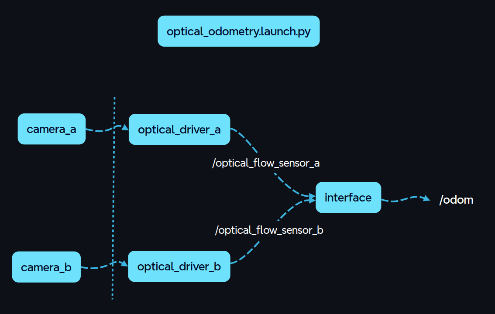
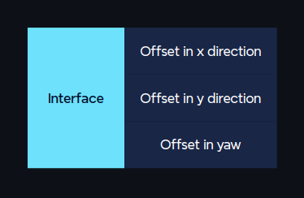
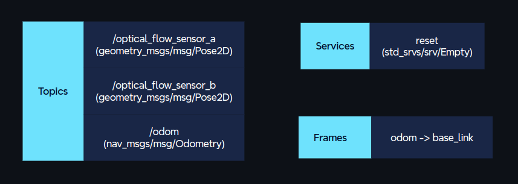

## Description

Alternative method to generate odometry data for **indoor** robots using optical flow sensor.

Devices that can be used as optical flow sensors
- [ ] USB mouse - requires USB driver
- [ ] Optical Flow sensor module, e.g MATEKSYS 3901-L0X, Avago ADNS-9500 - requires low level communication driver as well as has some minimum height issues.
- [ ] General Purpose Camera, e.g RaspberryPi camera - requires to design a custom cross-corelation algorithm.

> Testing on USB MOUSE, referred to as sensor.

Since the sensor does not provide rotation about z, utilization of two mice in conjugation is a need.

Using only a single optical flow sensor, with no additional sensors - consider the following scenario:
drive forward 5 feet
rotate in-place around the sensor 180 degrees
drive forward another 5 feet
… what is the position of the robot according to the sensor?

**Challenges:**<br><br>
Performance highly depends on the surface of the ground. Rough terrains, high reflective surfaces are not suitable.

**Node Structure:**
- Low level driver: Communicates with hardware : publishes data on individual sensor topic - x2  for each mice, descriptor will store data of all devices, driver should choose which to use 	
- High level driver: which publishes data on topic odom by subscribing to individual sensor topics and performing the mathematical operations.

<p align="center">
	
</p>

**Parameters:**<br>
- Device description - Vendor Id, Product ID, Bus No. USB Address, DPI
- Position of sensor from center of robot - x, y, yaw

<p align="center">
	
</p>

**Topics:**<br>
- /optical_driver_1/usb_driver
- /optical_driver_2/usb_driver
- Odom

**Services:**<br>
- Reset initial pose

**Frames:**<br>
- Odom => base_link

<p align="center">
	
</p>

> ⚠️ **Note:** The initial position fo the robot is consider to be that from when the launch file is launched.

### descriptor.py

The descriptor script displays the device description of all the connected USB devices. Descriptor also stores the device description to a `.json` file in case of need.

### usb_driver.py

`usb_driver` ros node listens on the the USB port for the specific device it has been launched for. The node publishes dx and dy registered by the individual sensor at a rate of `50 Hz`. Since the sensor works on interrupt transfer mode if the robot is not moving, no data is transferred by the sensor. Timeout methods ensures the node ends the listening process after every `10ms`. And so this inactivity is logged with a throttle period of `1sec`. In case of sensor disconnection the node logs this information and terminates it execution.

### interface.py

### optical_odometry.launch.py

The launch file launches 2 instances of usb_driver with device description as parameters dedicated to receive data from each sensor. Launch file also launches interface node with pose parameters defining the position of sensors with respect to center of the robot.

## How to Install Mouse on Robot

## Tested on

RaspberryPi 4B running Ubuntu 22.04 using HP - MOFYUO 

## Usage

Install pyusb

```py
pip install pyusb
```

Clone repository in your workspace and perform,

```py
colcon build --packages-select optical_odometry --symlink-install
```
in the root of your workspace.

Run descriptor script,

```py
cd <project_ws>/src/scripts/

python3 descriptor.py
```

Results after executing descriptor,
```py
python3 descriptor.py 
Found 1 device(s) connected
---
{'Vendor ID': 1008},
{'Product ID': 4938},
{'Bus': 1},
{'Address': 29},
```

Replace the device description displayed on the terminal within the launch file under `parameters` section of Node definition. Add DPI of the device of the device as well.


```py
optical_driver_1 =  Node(
        package='optical_odometry',
        executable='usb_driver',
        name='usb_driver',
        namespace='optical_driver_1',
        output='screen',
        emulate_tty=True,
        parameters=[
            {'Vendor ID': 1008},
            {'Product ID': 4938},
            {'Bus': 1},
            {'Address': 8},
            {'Dpi': 800},
        ],
    )
# Node definition where device description needs to be updated.
```

Launch nodes,

```py
ros2 launch optical_odometry optical_odometry.launch.py 
```
> Every time the launch file is updated build the package

Robot's odometry should be published on the topic /odom

If received,
```py
usb.core.USBError: [Errno 13] Access denied (insufficient permissions)
``` 
refer `Issues` section

## ToDos

~~- [ ] Shell script that run everytime device is unplugged and plugged again and the system boots to update the dynamic address of device~~

- [x] Device description copied manually from terminal using descriptor
- [x] Test on Raspberry Pi
- [x] Better identification of physical device - descriptor script
- [ ] Tackle dynamic updation of device address

### descriptor.py

~~- [ ] If `bInterfaceClass` not found in `Interface Descriptor` check in `Device Descriptor`~~

- [x] What if two devices have same `idVendor` and `idProduct`, differentiate using `bus` and `address` attributes
- [ ] Verify vendor and product id of device with same model number
    
### usb_driver.py

- [x] generate translation data data 
- [x] ros node
- [x] read description data via rosparam
- [x] DPI as node parameter
- [x] Publish only dx and dy
- [ ] Node should not terminate in case of device description - it should recover after device is connected.

### interface.py

- [ ] Mathematical model
- [ ] Services
- [ ] frames
- [ ] parameter for distance between sensor and robot's center


What can be different for different sensors with different model number

- [x] Vendor Id - Identified by descriptor
- [x] Product Id - Identified by descriptor
- [x] Assigned address - Identified by descriptor
- [x] Bus Number - Identified by descriptor
- [ ] Incoming data size
- [ ] Appearance of x and y translation in the incoming data frame
- [x] DPI - set as node parameter


## Issues

If received,

```python
  File "/home/aditya/project_ws/src/optical-odometry/usb_driver.py", line 20, in <module>
    device.reset()
  File "/home/aditya/.local/lib/python3.10/site-packages/usb/core.py", line 959, in reset
    self._ctx.managed_open()
  File "/home/aditya/.local/lib/python3.10/site-packages/usb/core.py", line 113, in wrapper
    return f(self, *args, **kwargs)
  File "/home/aditya/.local/lib/python3.10/site-packages/usb/core.py", line 131, in managed_open
    self.handle = self.backend.open_device(self.dev)
  File "/home/aditya/.local/lib/python3.10/site-packages/usb/backend/libusb1.py", line 804, in open_device
    return _DeviceHandle(dev)
  File "/home/aditya/.local/lib/python3.10/site-packages/usb/backend/libusb1.py", line 652, in __init__
    _check(_lib.libusb_open(self.devid, byref(self.handle)))
  File "/home/aditya/.local/lib/python3.10/site-packages/usb/backend/libusb1.py", line 604, in _check
    raise USBError(_strerror(ret), ret, _libusb_errno[ret])
usb.core.USBError: [Errno 13] Access denied (insufficient permissions)
```

Custom rules are to be added to give access instead of executing the script at sudo level

```py
cd /etc/udev/rules.d/

sudo nano usb-rules.rules
```

Add,

```py
SUBSYSTEM=="usb", ATTR{idVendor}=="<Vendor_ID>", ATTR{idProduct}=="<Product_ID?", MODE:="0666"
```

```py
sudo udevadm control --reload-rules
```

Unplug the device and plug again,

Execute descriptor and then usb_driver for the address to be reflected

## Handy Commands

```py
lsusb
lsusb -t
lsusb -D /dev/bus/sub/<bus>/<address>
```