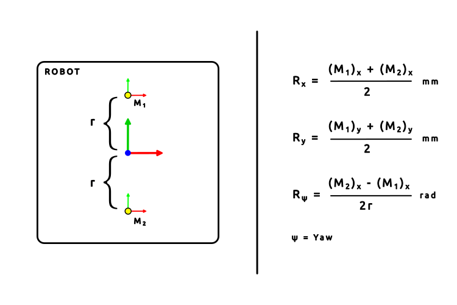

## Description

Alternative method to generate odometry data for **indoor** robots using optical flow sensor.

Devices that can be used as optical flow sensors
- [ ] USB mouse - requires USB driver
- [ ] Optical Flow sensor module, e.g ~~MATEKSYS 3901-L0X, Avago ADNS-9500~~ - requires low level communication driver as well as has some minimum height issues.
  - [PWM3901](https://holybro.com/products/pmw3901-optical-flow-sensor)
  - [PAA5100JE](https://shop.pimoroni.com/products/paa5100je-optical-tracking-spi-breakout?variant=39315330170963)
  - [Libs for above sensor](https://github.com/pimoroni/pmw3901-python)
- [ ] General Purpose Camera, e.g RaspberryPi camera - requires to design a custom cross-corelation algorithm.

**This branch tests the ideology of utilizing RGB camera and performing cross corelation algorithm in gazebo simulation environment**


**Challenges:**<br><br>
Performance highly depends on the surface of the ground. Rough terrains, high reflective surfaces are not suitable.

**Node Structure:**
- Low level driver: Communicates with hardware : publishes data on individual sensor topic - x2  for each mice, descriptor will store data of all devices, driver should choose which to use 	
- High level driver: which publishes data on topic odom by subscribing to individual sensor topics and performing the mathematical operations.

<p align="center">
	
</p>

**Parameters:**<br>
- Device description - Vendor Id, Product ID, Bus No. USB Address, DPI
- Position of sensor from center of robot - x, y, yaw

<p align="center">
	
</p>

**Topics:**<br>
- /optical_driver_1/usb_driver
- /optical_driver_2/usb_driver
- /odom

**Services:**<br>
- Reset initial pose

**Frames:**<br>
- odom => base_link

<p align="center">
	
</p>

> ⚠️ **Note:** The initial position fo the robot is consider to be that from when the launch file is launched.

## Mathematical Model

> **Note:** Naming Convention: RGB => x, y, z 

> Positive direction for rotation follows right hand thumb.

<h4 align="center">
	General Math Model
</h4>

<p align="center">
	
</p>

<p align="center">
(R<sub>x</sub>)<sub>M1</sub>: Translation in x-direction of Robot interpreted by Sensor M<sub>1</sub>
<br>
(R<sub>y</sub>)<sub>M1</sub> : Translation in y-direction of Robot interpreted by Sensor M<sub>1</sub>
<br>
(R<sub>ψ</sub>)<sub>M1</sub> : Rotation about z-axis of Robot interpreted by Sensor M<sub>1</sub>
<br>
<br>
θ, (M<sub>1</sub>)<sub>θ</sub> : Orientational offset of sensor M<sub>1</sub> wrt Robot
<br>
(M<sub>1</sub>)<sub>px</sub> : Positional offset of sensor M<sub>1</sub> wrt Robot in x-direction
<br>
(M<sub>1</sub>)<sub>py</sub> : Positional offset of sensor M<sub>1</sub> wrt Robot in y-direction
<br>
<br>
R<sub>x</sub> : Translation  in  x-direction  of  Robot
<br>
R<sub>y</sub> : Translation  in  y-direction  of  Robot
<br>
R<sub>ψ</sub> : Rotation  about  z-axis  of  Robot
</p>

<h4 align="center">
	Special Case
</h4>

<p align="center">
	
</p>

## Tested On

- Ubuntu 22.04
- ROS2 Humble
- Gazebo Classic V11


## Usage

To test the system in simulation environment, 

Clone repository in your workspace

```py
git clone git@github.com:maker-ATOM/optical-odometry.git
```

and perform,

```py
colcon build --packages-select optical_odometry_gazebo --symlink-install
```
in the root of your workspace.

Launch the bringup file which launches rviz2, gazebo and spawns the turtlebot3.

```py
ros2 launch optical_odometry_gazebo bringup.launch.py
```

## ToDos


## Issues

## Handy Commands